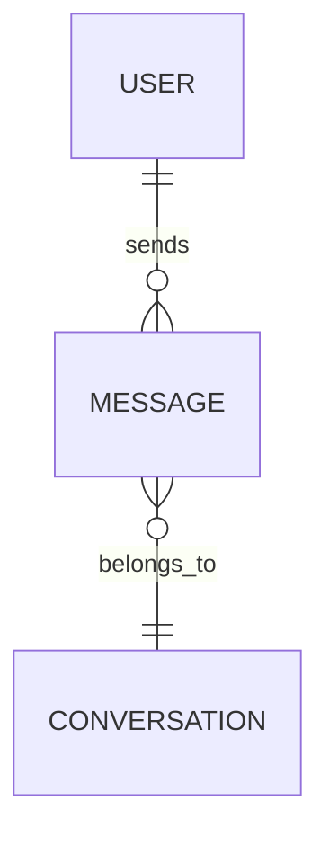

# data-plan

## Trigger

Ur-Plan exists and is accepted. User wants the data layer planned before the API surface. Typical phrases: "plan the data model", "design the schema", "next: entities".

Do **not** use this skill:

- Without `design/UR_PLAN.md` — run `/sdcd:new-project` first.
- For projects with no persistent state (pure-compute CLI, stateless transformer). Skip straight to `/sdcd:backend-plan` (or whatever is next).
- To revise an approved Data-Plan — edit the file directly.

## Procedure

### Step 1 — Load Ur-Plan

Read `design/UR_PLAN.md`. Extract: nouns (candidate entities), success criteria with data implications ("store up to N rows", "retrievable in <X ms"), non-goals that exclude entire categories of data.

If no entities can be found in the Ur-Plan, the project may not need a data-plan at all — stop and tell the user.

### Step 2 — Draft the Data-Plan

Write `design/DATA_PLAN.md`:

```markdown
# <Project> — Data Plan

_Derived from UR_PLAN.md — {today}_

## Entities

3–7 core entities. Per entity:

- **Name** — singular, domain-meaningful (not `ItemEntity`, just `Message`).
- **Purpose** — one line. What real-world thing does it represent?
- **Key fields** — the essential attributes. Names + conceptual types (not column types yet). No exhaustive list; pick the fields a reader needs to understand identity and intent.
- **Identity** — natural key, surrogate UUID, compound, or content-addressable.

## Relationships

Diagram + prose. Mermaid ER-style preferred:



Per relationship: cardinality, ownership (who deletes cascades to whom), optional vs required.

## Storage choice

Per entity: which store (SQL table / document collection / blob / cache / event log). State the reason — "queried by user_id + timestamp range" forces an index-friendly store; "opaque blob read once" allows object storage.

Default to one store for the core entities unless there's a hard reason to split.

## Indexes

Per query pattern from the success criteria, name the index(es) needed to hit the performance target. If a pattern needs no index (scan OK at expected volume), say so with the volume assumption.

## Data lifecycle

Per entity:

- **Creation** — how does it get into the system.
- **Mutation** — who writes, how often.
- **Retention** — how long it lives. Flag anything that grows unboundedly.
- **Deletion** — soft (tombstone) / hard. Cascade rules.

## Migrations

If the project has existing data: migration strategy (one-off script / incremental / shadow-read-new-write-both / …). If greenfield: "migrations start from an empty schema; first migration creates the entities above."

## Seed / fixture data

What data must exist for the app to run or tests to pass. Separate "seed for production bootstrap" from "fixtures for test envs" — they're rarely the same data.

## Privacy & retention (for PII-bearing entities)

If any entity holds personal data: retention period, deletion obligation, export obligation, pseudonymisation. Skip the section if no PII.

## Open questions

Data unknowns that feed backend planning or need user/business input.
```

### Step 3 — Dispatch challenger trio

- `challenger-security` — PII exposure, encryption at rest, audit-trail gaps, authz that should be enforced at the data layer (row-level security, tenant isolation).
- `challenger-performance` — missing indexes for stated query patterns, unbounded entity growth, hot partitions, N+1 shapes baked into the relationships.
- `challenger-maintainability` — entity fragmentation ("we have five kinds of Thing"), implicit polymorphism (one table stores N kinds), migration strategy that requires downtime.

Synthesise into a `## Challenger pushback` section at the bottom.

### Step 4 — Present & pause

Show:

1. ERD + storage-choice table (the two things a user skims fastest).
2. Top three challenger concerns.
3. Question: "address now or land in Open questions?"

Do not proceed to backend-plan in the same turn.

## Invariants

- **Types are conceptual, not column-level.** "string", "timestamp", "money-decimal" are fine here. Exact DDL is implementation.
- **Entity names are domain terms.** Not `UserEntity`, `UserDAO`, `UserModel`. Just `User`.
- **Every storage choice has a reason.** "We're using Postgres because we know Postgres" is a valid reason — but it must be stated.
- **Every index anchors to a query pattern.** No speculative indexes.
- **Retention is not optional for PII.** If the section is empty and PII exists, that's a block-severity finding.
